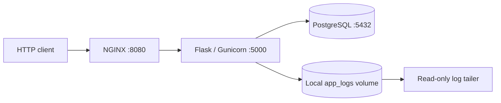

# Containerized API stack with Docker Compose and Swarm

An educational Flask/PostgreSQL stack exploring reverse proxying, network
separation, container users, secret files and service replication. Docker Compose
provides a local environment; the Swarm manifest demonstrates orchestration
settings on a single-node lab.

## Architecture



Only NGINX publishes a host port. The API and database communicate over an
internal backend network. See [architecture and deployment differences](docs/architecture.md).

## What is implemented

- `GET /`: JSON response confirming that the API process is responding.
- `GET /db`: PostgreSQL connectivity check; returns 200 or 503.
- NGINX forwards HTTP requests to Gunicorn.
- Non-root API and log-monitor containers.
- Compose uses a read-only NGINX root filesystem with a writable temporary mount.
- Swarm uses the external `db_password` secret, two API replicas, rolling-update
  and rollback configuration.
- API logging to stdout and a shared local volume; a separate container tails
  that file.

The monitor is a log tailer. There are no metrics dashboards, tracing, alerting
rules, authentication or TLS termination in this project.

## Local Compose quick start

Requires Docker with the Compose plugin and Linux-container support.
Run from the repository root.

PowerShell:

```powershell
$env:DB_PASSWORD = Read-Host 'Local demonstration database password'
docker compose up --build -d
curl.exe --fail http://localhost:8080/
curl.exe --fail http://localhost:8080/db
docker compose logs --tail=50 api monitor
docker compose down
Remove-Item Env:DB_PASSWORD
```

Bash:

```bash
read -rs -p 'Local demonstration database password: ' DB_PASSWORD; echo
export DB_PASSWORD
docker compose up --build -d
curl --fail http://localhost:8080/
curl --fail http://localhost:8080/db
docker compose logs --tail=50 api monitor
docker compose down
unset DB_PASSWORD
```

These commands preserve the database volume. PostgreSQL applies its initial
password when creating a fresh data directory; changing the environment variable
alone does not rotate the password of an existing database.

Compose falls back to the literal demo password `changeme` if no value is set.
Its published port listens on all host interfaces by default. Use an isolated
local lab; configure authentication, TLS and exposure deliberately before any
public deployment.

## Single-node Swarm lab

Use a dedicated single-node Swarm environment. These commands change that
environment's orchestration state; they are not needed for the Compose demo.

```bash
docker swarm init
docker build -t secure-microservices-swarm-api:latest ./api
docker build -t secure-microservices-swarm-reverse:latest ./nginx
docker build -t secure-microservices-swarm-monitor:latest ./monitor
```

Create `db_password` once from an owner-managed password file outside this
repository, then deploy:

```bash
docker secret create db_password /absolute/path/outside-repository/db-password.txt
docker stack deploy -c stack.yml secure-demo
docker stack services secure-demo
curl --fail http://localhost:8080/
curl --fail http://localhost:8080/db
```

If the secret already exists, use the intended existing secret; do not remove
an in-use secret to rerun this example. Keep the password file private and out
of Git. Docker stack deployment does not build images.

Images are locally tagged and volumes use the `local` driver. A multi-node
deployment needs a registry and a deliberate storage/logging strategy:
same-named volumes on different nodes do not share data, and the single monitor
will not collect logs from every node. Two API replicas do not make the database
or the whole stack highly available.

## CI and validation

[GitHub Actions](.github/workflows/ci.yml) parses the YAML, validates Compose
configuration and builds all three custom images. It does not deploy the stack,
run an integration suite, publish images or scan vulnerabilities.

```bash
docker compose config --quiet
docker compose -f stack.yml config --quiet
```

Local review on 29 September 2026 checked configuration parsing and the Flask
health endpoint. [GitHub Actions run 5](https://github.com/AhmedKarray005/secure-microservices-swarm/actions/runs/36560220432)
also passed all three Docker image builds. Live PostgreSQL connectivity and
Compose/Swarm deployment remain unverified; the local Docker engine was unavailable.

## Repository map

- `api/`: Flask routes, database check and Gunicorn image.
- `nginx/`: reverse-proxy configuration and startup script.
- `monitor/`: shell log tailer.
- `docker-compose.yml`: local environment.
- `stack.yml`: Swarm services, networks, volumes and external secret.
- `docs/architecture.md`: topology, tradeoffs and limits.

## Engineering limits

This project demonstrates selected container controls, not a complete security
baseline. Database-error details are returned by `/db`; restrict or sanitize
that diagnostic endpoint for a public service. Dependency/image scanning,
database backups, log rotation, distributed logging and workload health checks
in Swarm remain future work.

[License](LICENSE)
