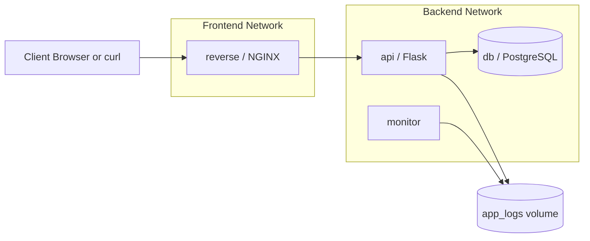

# Architecture

This project demonstrates a secure and understandable microservices layout built around Docker networking and container hardening fundamentals.

## Services

- `reverse`: NGINX reverse proxy exposed on port `8080`
- `api`: Flask application that serves health and database checks
- `db`: PostgreSQL database for application state
- `monitor`: log tailing container for operational visibility

## Data Flow

1. External traffic enters the system through `reverse`.
2. NGINX proxies requests to `api` over the private backend network.
3. The Flask API optionally connects to `db` when the `/db` route is called.
4. The API writes operational logs to the shared `app_logs` volume.
5. The `monitor` container tails the API log file from that shared volume.

## Networks

### Frontend

- Purpose: public ingress
- Connected services: `reverse`
- Exposure: host port `8080`

### Backend

- Purpose: private service-to-service communication
- Connected services: `reverse`, `api`, `db`
- Exposure: internal-only

In Docker Compose, `backend` uses the bridge driver with `internal: true`.
In Docker Swarm, `backend` uses an internal overlay network.

## Volumes

### `db_data`

- stores PostgreSQL data files
- ensures database state survives container restarts

### `app_logs`

- stores API log output
- allows the monitor container to read logs without calling the API

## Secrets

For local Compose usage, the database password is passed through the `DB_PASSWORD` environment variable for simplicity.

For Docker Swarm, the password is mounted as the `db_password` secret and consumed through:

- `POSTGRES_PASSWORD_FILE` in PostgreSQL
- `DB_PASSWORD_FILE` in Flask

## Security Controls

- only `reverse` publishes a port to the host
- `db` remains private on the backend network
- API container runs as a non-root user
- monitor reads logs from disk instead of exposing a dashboard or API
- NGINX container is read-only in Docker Compose
- backend networking is marked internal to reduce accidental exposure

## Compose vs Swarm

### Docker Compose

- optimized for local development and recruiter-friendly demos
- uses `network_mode: none` for `monitor`
- uses environment variables for the database password

### Docker Swarm

- optimized for orchestration concepts and portfolio value
- uses overlay networks and a real Swarm secret
- runs multiple `api` replicas
- defines restart and rolling update policies
- keeps the reverse proxy writable on Docker Desktop local Swarm for NGINX runtime compatibility

One practical limitation is that Docker Swarm stacks do not support a true no-network mode equivalent to Compose's `network_mode: none`. For that reason, `monitor` stays on the private backend network in Swarm while remaining inaccessible from the host.

## Mermaid Diagram

